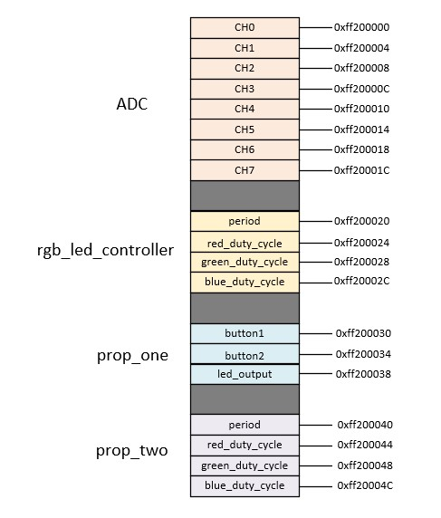

# 467-final-project-culwell-gill

This repository is Josh Culwell's and Nicholas Gill's final project for the EELE-467 SoC-FPGAs Software Hardware Codesign course. This project impliments core concepts taught by the course: writing HDL on the FPGA and writing software to control it through the Linux Kernel.   

### FPGA 

The FPGA used for this project was the [Terrasic DE-10 Nano](https://www.terasic.com.tw/cgi-bin/page/archive.pl?Language=English&CategoryNo=167&No=1046) 

## Overview

The final project description was as follows: design an RGB LED Controller and two custom components with their own functionalities. Instructions for installing the required drivers and software are included in the READMEs.

## Avalon Wrapper Memory Map

## rgb_led_controller
This program controls an RGB LED with three potentiometers. An analog to digital converter reads a voltage set by each of the potentiometers via HDL and writes a value to a register. The register is then read by a program running in the linux kernel, the kernel then sends the received data to another HDL file that interprets the data: a pulse width modulation controller. The pulse width modulation controller sets the intensity of each color in the RGB LED by varying the amount of time the LED experiences a logical high. The result is a color changing LED that is controlled with three knobs.

## prop_one
"prop-one" or "Proposal one" is the first custom component of the project: it is a "running LED" controller. The DE-10 NANO has an array of 8 LEDs that can be controlled via HDL. The idea of this program is to illuminate these LEDs one at a time and squentially, as if to create a light that "runs" along the array. The direction of the light can be controlled via two buttons on a breadboard through GPIO. HDL senses button presses through the FPGA GPIO ports and writes to an output register. The output register is then read by the kernel, the kernel interprets which direction the LED is traveling and performs a bit shift to a variable that is able to control the output of the LEDs. The shifted variable is then sent to the input register of another HDL file that drives the output of the LEDs. The result is a fun little running light that can be controlled to move left or right.  

## prop_two
"prop-two" or "Proposal two" is the second custom component of the project: it is an LED that blinks a number of times according to a value set by the FPGA's four slide switches. HDL is written that reads the position of the switches and status of the "trigger" button on the FPGA, the data is then sent to an output register. The output register is read by a program running in the linux kernel; once the button is pressed, the linux kernel will drive a variable representing the LED's output according to the switch data that it received. The LED will blink the amount of times specified by the four bit nibble selected with the switches. 

## Documentation: READMEs

### HDL
- [pwm_controller](/hdl/final-core/pwm_controller/README.md)
- [rgb_led_controller](/hdl/final-core/rgb_led_controller/README.md)
- [prop_one_controler](/hdl/final-proposals/prop_one_controller/README.md)
- [prop_two_controller](/hdl/final-proposals/prop_two_controller/README.md)

### Device Drivers
- [adc](/linux/adc/README.md)
- [dts](/linux/dts/README.md)
- [rgb_controller](/linux/rgb-controller/README.md)
- [prop_one_controller](/linux/proposals-controllers/prop_one_controller/README.md)
- [prop_two_controller](/linux/proposals-controllers/prop_two_controller/README.md)

### Software
- [final_project](/sw/final-core/README.md)
- [prop_one](/sw/final-proposals/prop_one/README.md)
- [prop_two](/sw/final-proposals/prop_two/README.md)

