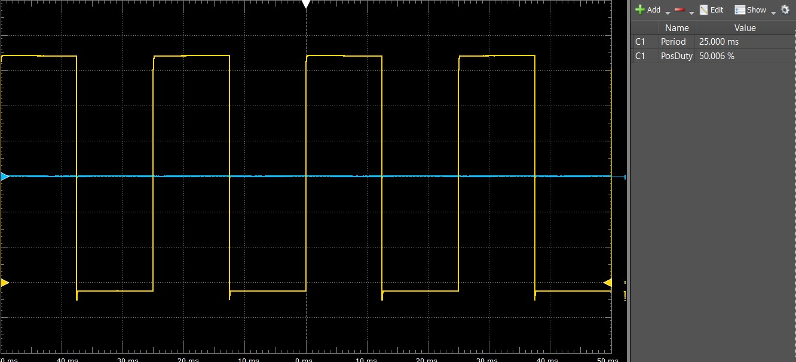

# pwm_controller

## About
The pwm_controller hdl file does exactly what the title implies, it provides pulse width modulation functionality to the LEDs any GPIO port on the DE-10 Nano. Pwm can be used to control the intensity of an LED light source, which is what we use it for in this project. The HDL file is essentially a timer that takes in a period and duty cycle, then drives an output depending on what the user desires.


## Function 
The user inputs a desired period and duty cycle. The period has 16 whole bits and 10 fractional bits. The duty cycle has 12 whole bits and 11 fractional bits. In the case of our project, the ADC controller inputs this data.

## Counter

```vhdl
		one_period <= unsigned(((1 ms / CLK_PERIOD) / 1024) * period); --one period is 1 of period in seconds.
		counter_limit <= unsigned((duty_cycle * one_period) / 2048); --one duty cycle
		
		PERIOD_COUNTER : process(clk, rst)
		begin
			if (rst = '1') then
				count <= to_unsigned(1, 32);
				done <= false;
				output <= '1';
				
			elsif (rising_edge(clk) and count < one_period) then
				count <= count + 1;
				done <= false;
				
				if (count < counter_limit) then output <= '1';
				else output <= '0';
				end if;
				
			elsif (rising_edge(clk) and count >= one_period) then
				count <= to_unsigned(1, 32);
				done <= true;
				
			end if;
		end process;
```

The hdl converts the period and duty cycles into large numbers that can be handled by fixed point arithmetic. The resulting values are then set at the limits of the counters displayed above. These counter limits are controlled by the outside world and can control the output (an led perhaps) in the following way. 





The photo above shows an oscillioscope screenshot of PWM output with 50% duty cycle. 