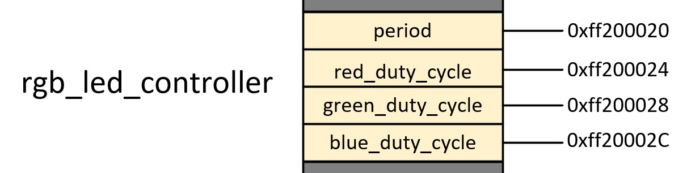
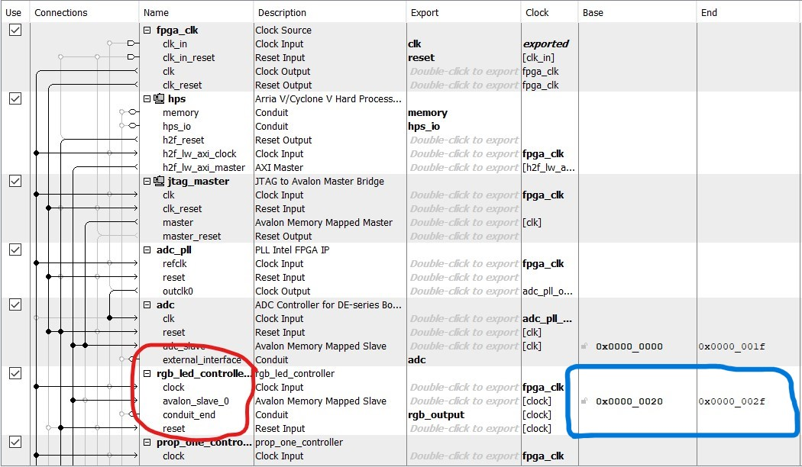

# rgb_led_controller

## About
The rgb_led_controller is the first hdl file that utilizes the Avalon bus wrapper in Quartus. This wrapper is what enables the ARM processor to control the HDL files on the FPGA via registers. In Quartus, the "Platform Designer" utility assigns the desired user registers to the HDL components. The rgb_led_controller uses three pwm_controller components, each component drives an individual LED in the RGB Controller project.  

## Function 
The rgb_led_controller hdl file drives pwm functionality to three LEDS: RED, GREEN, and BLUE. Each LED has an independent, controllable duty cycle the controls its intensity. These duty cycles will come from the output of the ADC controller, this is discussed in the ADC Readme. For now, we will discuss setting up the device HDL and linking the HDL with registers in "Platform Designer".

## Register Map
 

The Avalon register locations are shown here

## HDL

```vhdl

entity rgb_led_controller is
	port(
		clk : in std_logic;
		rst : in std_logic;
		avs_read : in std_logic;
		avs_write : in std_logic;
		avs_address : in std_logic_vector(1 downto 0);
		avs_readdata : out std_logic_vector(31 downto 0);
		avs_writedata : in std_logic_vector(31 downto 0);
		rgb_output : out std_logic_vector(2 downto 0)
	);
end entity;

```

Avalon control signals are mapped into the rgb_led_controller's entity. This allows the compiler to easily create files that link registers to the signals in our HDL for our control via the bus. Here's a look at the component instantiation in the file.

```vhdl

architecture rgb_led_controller_arch of rgb_led_controller is
	component pwm_controller is
		generic (
			CLK_PERIOD : time := 20 ns
		);
		port (
			clk : in std_logic;
			rst : in std_logic;
			period : in unsigned(16 - 1 downto 0);
			duty_cycle : in unsigned(12 - 1 downto 0);
			output : out std_logic
		);
	end component;

```
Here is how the component is connected to an individual LED signal.


```vhdl

	signal period : unsigned(15 downto 0);
	signal red_duty_cycle : unsigned(11 downto 0);
	signal green_duty_cycle : unsigned(11 downto 0);
	signal blue_duty_cycle : unsigned(11 downto 0);
	
begin
	RED_PWM_CONTROLLER : pwm_controller
		generic map (CLK_PERIOD => 20 ns)
		port map (clk => clk, rst => rst, period => period, duty_cycle => red_duty_cycle, output => rgb_output(0));

```

This process is repeated three times, once for each LED. Next, we will look at creating the HDL that provides the register mapping functionality of the file. The functionality of reading and writing addresses is defined via HDL. A process is created for each action.

```vhdl
avalon_register_read: process(clk)
	begin
		if rising_edge(clk) and avs_read = '1' then
			case avs_address is
				when "00" =>
					avs_readdata <= (others => '0');
					avs_readdata(15 downto 0) <= std_logic_vector(period);
				when "01" =>
					avs_readdata <= (others => '0');
					avs_readdata(11 downto 0) <= std_logic_vector(red_duty_cycle);
				when "10" =>
					avs_readdata <= (others => '0');
					avs_readdata(11 downto 0) <= std_logic_vector(green_duty_cycle);
				when "11" =>
					avs_readdata <= (others => '0');
					avs_readdata(11 downto 0) <= std_logic_vector(blue_duty_cycle);
				when others => avs_readdata <= (others => '0');
			end case;
		end if;
	end process;

```
The case statement above allows the wrapper to read at individual addresses. Each case in the case statement corresponds with a different address in the HDL. This process takes signal data and loads into into the read register.

```vhdl

avalon_register_write: process(clk, rst)
	begin
		if rst = '1' then
			period <= to_unsigned(0, 16);
			red_duty_cycle <= to_unsigned(0, 12);
			green_duty_cycle <= to_unsigned(0, 12);
			blue_duty_cycle <= to_unsigned(0, 12);
			
		elsif rising_edge(clk) and avs_write = '1' then
			case avs_address is
				when "00" => period <= unsigned(avs_writedata(15 downto 0));
				when "01" => red_duty_cycle <= unsigned(avs_writedata(11 downto 0));
				when "10" => green_duty_cycle <= unsigned(avs_writedata(11 downto 0));
				when "11" => blue_duty_cycle <= unsigned(avs_writedata(11 downto 0));
				when others => null;
			end case;
		end if;
	end process;

```
This case statement allows users to write to the HDL registers.  

The "Platform Designer" utility is then used to define what address the case statements point to. This is one peice of the Avalon wrapper in this project, a screenshot of the utility is provided. 



The current Avalon memory slave for this HDL has been circled, the red circle shows the "conduit" responsible for connecting the signals to the wrapper. The blue circle shows the starting memory location within the project: 0x00000020. This location in memory is where case 0 resides in the HDL. After compiling, the HDL is now accessable via registers. 