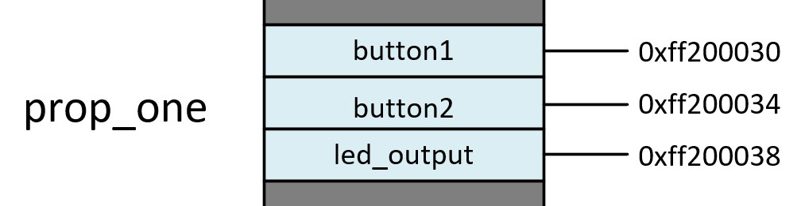
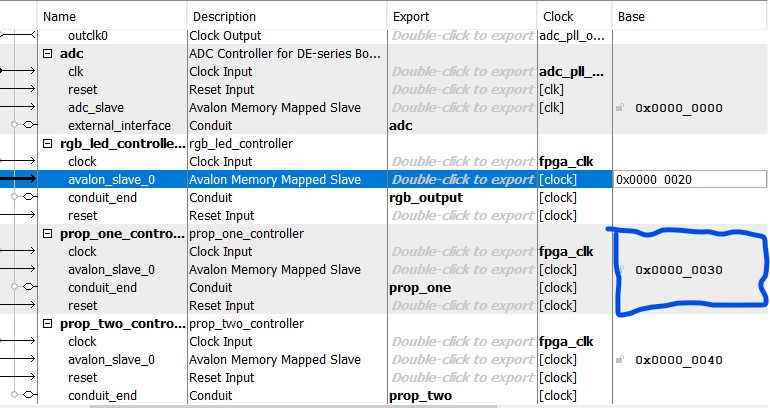

# prop_one_controller

## About
The prop_one_controller is an intermediary HDL file that connects the LEDS or GPIO outputs of the FPGA to memory. The primary function of this HDL file is to link a C file that controls a running led depending on the state of two buttons. Setting up this file is similar to the process found in the [rgb_led_controller](/hdl/final-core/rgb_led_controller/README.md) Readme.

## Function 
This file connects registers in memory with signals in the HDL structure. 

## Register Map




## HDL

```vhdl
leds_out <= led_output;
	button_1 <= buttons(0);
	button_2 <= buttons(1);
		
	avalon_register_read: process(clk)
	begin
		if rising_edge(clk) and avs_read = '1' then
			case avs_address is
				when "00" =>
					avs_readdata <= (others => '0');
					avs_readdata(0) <= button_1;
				when "01" =>
					avs_readdata <= (others => '0');
					avs_readdata(0) <= button_2;
				when "10" =>
					avs_readdata <= (others => '0');
					avs_readdata(6 downto 0) <= led_output;
				when others => avs_readdata <= (others => '0');
			end case;
		end if;
	end process;
	
	avalon_register_write: process(clk, rst)
	begin
		if rst = '1' then
			led_output <= "0000000";
		elsif rising_edge(clk) and avs_write = '1' then
			case avs_address is
				when "10" => led_output <= avs_writedata(6 downto 0);
				when others => null;
			end case;
		end if;
	end process;
end architecture;
```
The HDL acts as a control conduit to the LEDS and provides state information about the buttons. An outside program can read the state of the buttons and then write values to the LEDs through the registers depending on the input of the buttons.

## Memory Location
The base address for the prop_one_controller is shown below in Platform Designer. 




