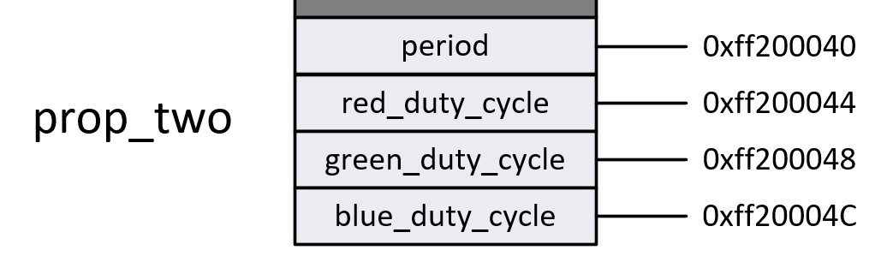
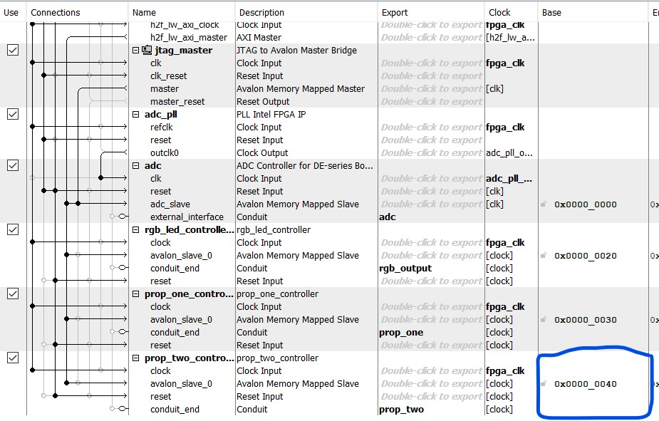

# prop_two_controller

## About
The prop_two_controller is an intermediary HDL file that connects the LEDS or GPIO outputs of the FPGA to memory. The primary function of this HDL file is to link a C file that controls a blinking led depending on a nibble defined by the state of four switches. Setting up this file is similar to the process found in the [rgb_led_controller](/hdl/final-core/rgb_led_controller/README.md) Readme.

## Function 
This file connects registers in memory with signals in the HDL structure. 

## Memory Map


## HDL

```vhdl
architecture prop_two_controller_arch of prop_two_controller is
	
	signal switch_register : std_logic_vector(3 downto 0);
	signal button_register, led_register : std_logic;
	
begin
	led <= led_register;
	button_register <= button;
	switch_register <= switches;
		
	avalon_register_read: process(clk)
	begin
		if rising_edge(clk) and avs_read = '1' then
			case avs_address is
				when "00" =>
					avs_readdata <= (others => '0');
					avs_readdata(0) <= led_register;
				when "01" =>
					avs_readdata <= (others => '0');
					avs_readdata(0) <= button_register;
				when "10" =>
					avs_readdata <= (others => '0');
					avs_readdata(3 downto 0) <= switch_register;
				when others => avs_readdata <= (others => '0');
			end case;
		end if;
	end process;
	
	avalon_register_write: process(clk, rst)
	begin
		if rst = '1' then
			led_register <= '0';
		elsif rising_edge(clk) and avs_write = '1' then
			case avs_address is
				when "00" => led_register <= avs_writedata(0);
				when others => null;
			end case;
		end if;
	end process;
end architecture;
```
The HDL acts as a control conduit to the LEDS and provides state information about a button and four switches. An outside program can interpret the state information pertaining to the button and switches via the read register, and then instantiate the LED through the write register.

## Memory Location
The base address for the prop_one_controller is shown below in Platform Designer. 




